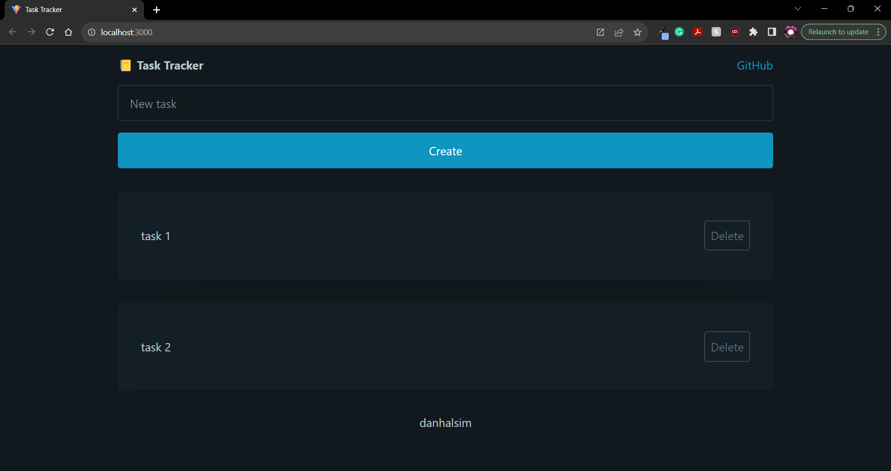

# Task Tracker

## Description

A simple task creator app.

https://danhalsim-task-tracker-f178c0efda88.herokuapp.com/

## Table of Contents

- [Technologies](#technologies)
- [Installation](#installation)
- [Usage](#usage)
- [Credits](#credits)
- [License](#license)
- [Contributions](#contributions)
- [Tests](#Tests)
- [Questions](#Questions)

## Technologies

- React
- Node
- Express
- Pico CSS

## Installation

Open the website. Create your tasks.

## Usage

Enter your task into the text box. Click "create" to add the new task. Click "delete" to delete the task.

## Credits

- Code With Sahand tutorial video for React component file structure
  - https://www.youtube.com/watch?v=alYtYAFDVaA

- UCI coding bootcamp class repository for server.js template

- AskBCS for help with debugging

## License

This project uses the MIT License.

https://opensource.org/licenses/MIT

## Contributions

N/A

## Tests

N/A

## Questions

If you have any questions about the project, please reach out!

Github: https://github.com/danhalsim

Email: dansim6935@gmail.com
